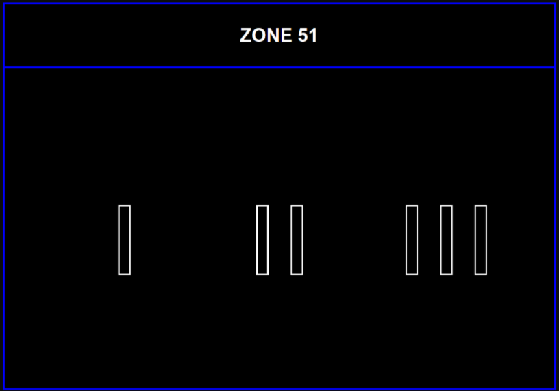
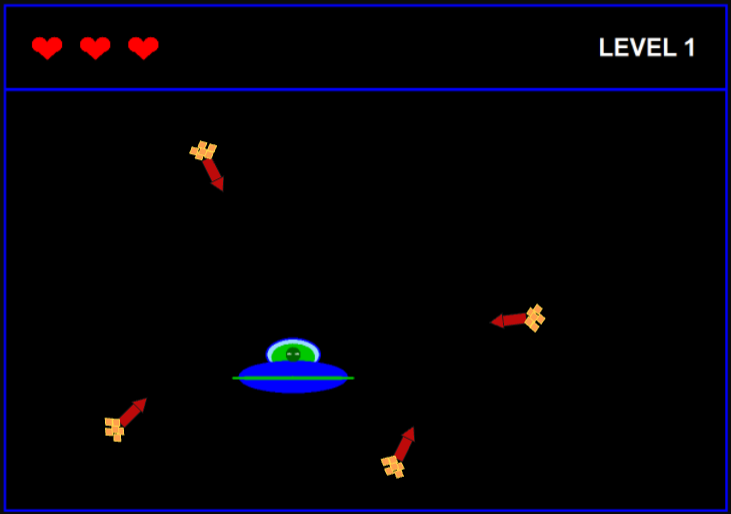
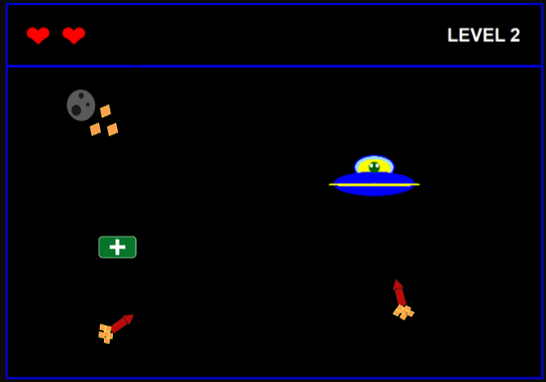
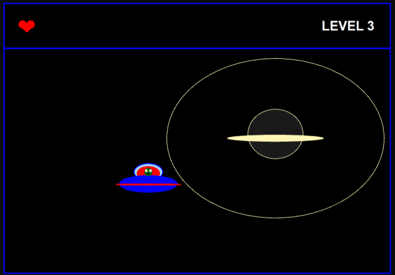

# `Zone 51`

### Description

This is a game about an alien who has wandered into a rather unfriendly part of the universe. Your task is to survive three levels and escape the sector of space known as **Zone 51**. Along the way, you will encounter *missiles*, *energy blasts*, *meteorites*, and even *black holes*.
 
### Key characteristics

1. Programming language: **C++**;
2. Methodology: **OOP**;
3. Graphics library: **Win32 API**.

### Gameplay

  

> Try to complete all three levels.

  

> Dodge the missiles.

  

> Explore space!

  

> But always look around you.